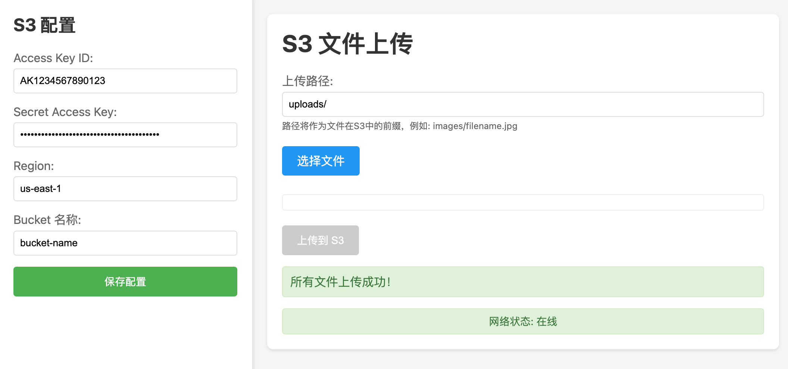

# S3 File Upload Tool

一个基于浏览器的AWS S3文件上传工具，支持多文件上传、上传进度显示、断点续传等功能。



## 功能特点

- 🚀 支持多文件同时上传
- 📁 自定义上传路径
- 📊 实时上传进度显示
- 🔄 自动重试机制
- 💾 本地保存S3配置
- 🌐 网络状态监控
- 📝 详细的调试日志

## 系统要求

- Node.js (推荐 v14.0.0 或更高版本)
- 现代浏览器（支持ES6+）
- AWS账号及相关凭证

## 安装步骤

1. 克隆项目到本地：

```bash
git clone <repository-url>
cd aws-s3-upload-web
```

2. 安装依赖：

```bash
npm install
```

3. 启动开发服务器：

```bash
npm start
```

服务器将在 http://localhost:3001 启动

## 服务管理

### 启动服务

```bash
npm start
```

### 停止服务

按 `Ctrl + C` (Windows/Linux) 或 `Command + C` (macOS) 停止服务

### 重启服务

1. 首先停止当前运行的服务：
   - 按 `Ctrl + C` (Windows/Linux) 或 `Command + C` (macOS)
   - 确保所有终端进程都已完全停止

2. 然后重新启动服务：
   ```bash
   npm start
   ```

### 查看运行状态

可以通过以下方式查看服务状态：

1. 检查终端输出信息
2. 访问 http://localhost:3001 验证服务是否响应
3. 使用以下命令查看端口占用情况：
   ```bash
   # Windows
   netstat -ano | findstr "3001"
   
   # macOS/Linux
   lsof -i :3001
   ```

### 常见问题处理

1. 如果端口被占用：
   ```bash
   # Windows
   netstat -ano | findstr "3001"
   taskkill /PID <进程ID> /F

   # macOS/Linux
   lsof -i :3001
   kill -9 <进程ID>
   ```

2. 如果服务无响应：
   - 停止当前服务
   - 清除终端进程
   - 重新启动服务

## AWS配置

使用本工具需要配置以下AWS凭证：

1. Access Key ID
2. Secret Access Key
3. Region（默认：us-east-1）
4. S3 Bucket名称

### 获取AWS凭证

1. 登录AWS控制台
2. 进入IAM服务
3. 创建新的IAM用户或使用现有用户
4. 确保用户具有以下S3权限：
   - s3:PutObject
   - s3:ListBucket

### S3存储桶配置

确保您的S3存储桶已正确配置CORS策略：

```json
[
    {
        "AllowedHeaders": [
            "*"
        ],
        "AllowedMethods": [
            "PUT",
            "POST",
            "GET"
        ],
        "AllowedOrigins": [
            "*"
        ],
        "ExposeHeaders": [
            "ETag"
        ]
    }
]
```

## 使用说明

1. 打开应用后，首先在左侧边栏填写AWS配置信息：
   - Access Key ID
   - Secret Access Key
   - Region（可选，默认us-east-1）
   - Bucket名称

2. 点击"保存配置"按钮保存设置（配置会保存在浏览器本地存储中）

3. 在主界面：
   - 可以设置上传路径（可选，默认为"uploads/"）
   - 点击"选择文件"按钮选择要上传的文件
   - 选中的文件会显示在列表中，包含文件名和大小信息
   - 点击"上传到S3"按钮开始上传

4. 上传过程：
   - 每个文件都会显示上传进度条
   - 上传状态实时更新
   - 如果上传失败，系统会自动重试（最多3次）
   - 底部会显示网络状态和调试信息

## 开发说明

### 项目结构

```
aws-s3-upload-web/
├── index.html      # 主页面
├── style.css       # 样式文件
├── main.js         # 主要逻辑
└── package.json    # 项目配置
```

### 本地开发

1. 修改代码后，服务器会自动重新加载
2. 调试面板会显示详细的日志信息
3. 网络状态监控可帮助诊断连接问题

### 错误处理

- 网络错误会自动重试
- 上传失败会显示具体错误信息
- 配置错误会立即提示

## 注意事项

1. 请确保AWS凭证安全，不要将其提交到代码仓库
2. 建议在生产环境中限制CORS策略的AllowedOrigins
3. 大文件上传可能受到浏览器限制，建议单文件不超过5GB
4. 确保有足够的网络带宽进行文件上传

## 故障排除

1. 如果上传失败：
   - 检查AWS凭证是否正确
   - 确认S3存储桶CORS配置
   - 查看调试面板的错误信息
   - 检查网络连接状态

2. 如果配置无法保存：
   - 清除浏览器缓存后重试
   - 确认浏览器支持localStorage

3. 如果文件无法选择：
   - 检查文件大小是否超出限制
   - 确认浏览器版本是否支持File API

## 安全建议

1. 使用具有最小权限的IAM用户
2. 定期轮换AWS访问密钥
3. 在生产环境中使用HTTPS
4. 根据需要限制上传文件的类型和大小
